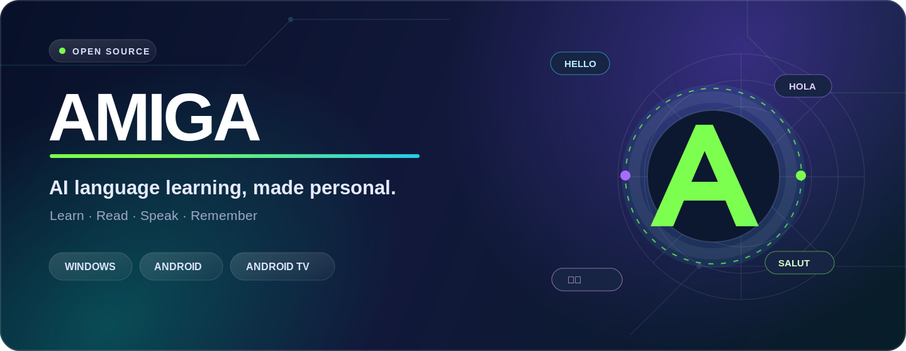
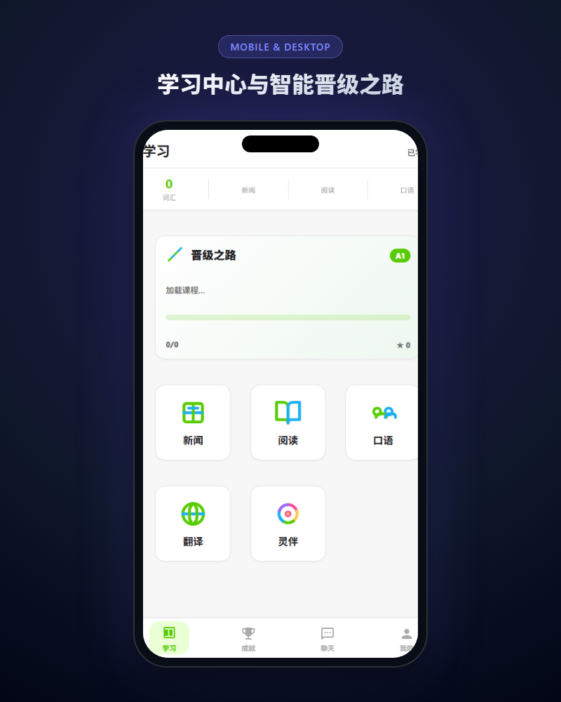
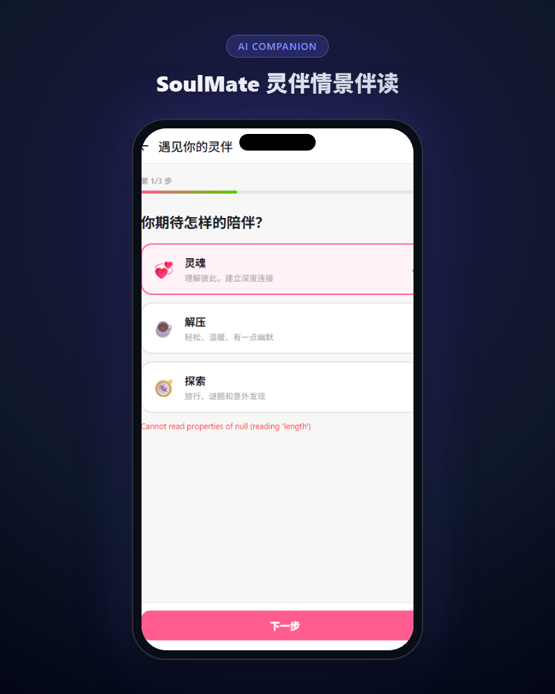
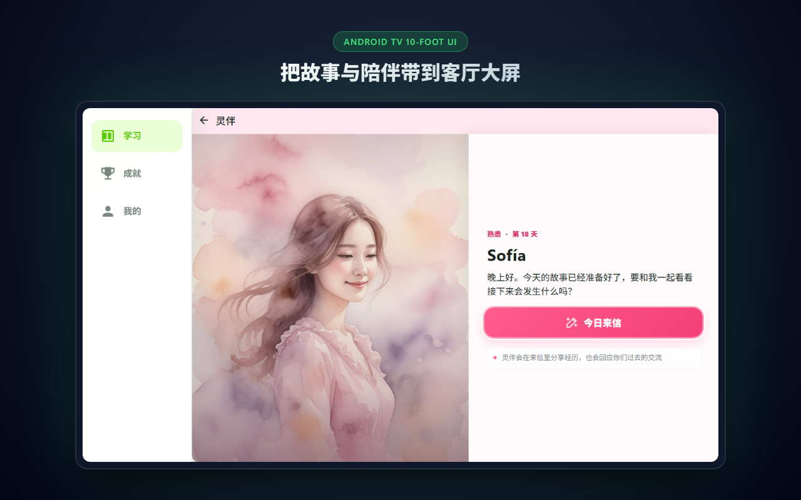
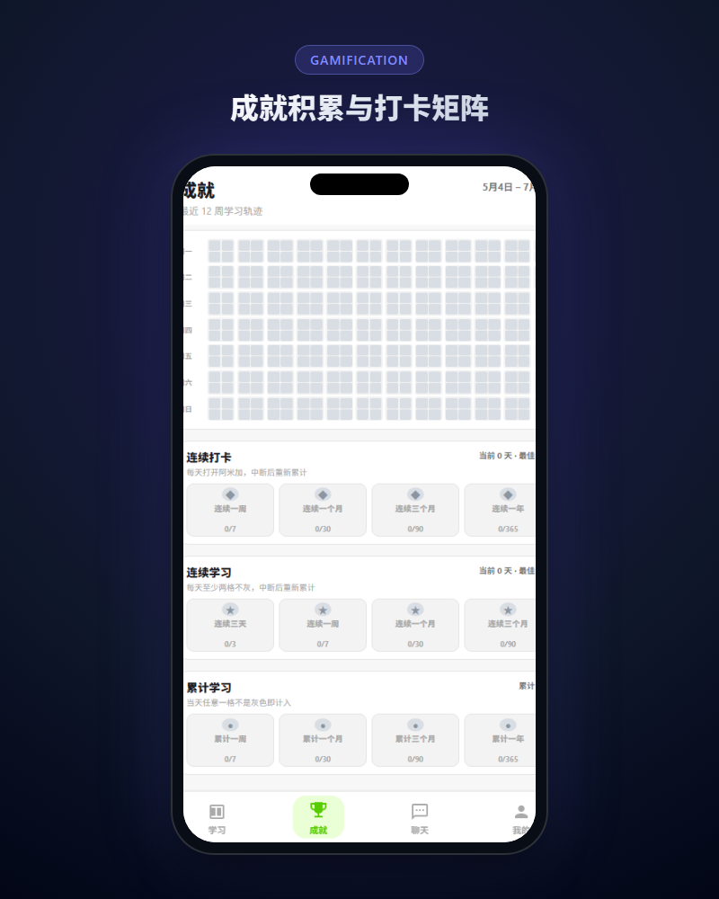

<div align="center">



<br />

[](https://github.com/wesele/Amiga/releases/latest)
[](https://github.com/wesele/Amiga/releases/latest)
[](https://github.com/wesele/Amiga/releases/latest)
[](https://tauri.app/)
[](https://vuejs.org/)
[](https://www.rust-lang.org/)

**免费 · 开源 · 无广告**

[下载应用](#download) · [精彩功能](#features) · [界面预览](#showcase) · [本地开发](#development) · [English](#english)

</div>

---

## 让语言不只停留在课程里

**Amiga（阿米加）** 是一款面向 Windows、Android 手机与 Android TV 的 AI 外语学习应用。它把分级课程、真实阅读、情景口语、词汇复习与持续成长放进同一个学习闭环——从“看懂一句话”，到“真正说出来”。

不是机械刷题，也不是只有一个聊天框。Amiga 会围绕你的目标语言、CEFR 等级和学习进度组织内容，让每次阅读、对话和复习都彼此连接。

<table>
  <tr>
    <td width="33%" valign="top">
      <h3>🧭 有方向地学</h3>
      <p>沿 CEFR 晋级之路推进，从词汇、语法到综合练习，清楚知道今天学什么、下一步去哪里。</p>
    </td>
    <td width="33%" valign="top">
      <h3>✨ 在语境中学</h3>
      <p>把新闻、阅读、故事与真实对话变成学习现场，让语言从知识点变成可理解、可使用的表达。</p>
    </td>
    <td width="33%" valign="top">
      <h3>📺 随处都能学</h3>
      <p>手机碎片学习、Windows 深度阅读、电视客厅沉浸练习，一套体验覆盖不同屏幕。</p>
    </td>
  </tr>
</table>

<a id="showcase"></a>

## 一眼走进 Amiga

<table>
  <tr>
    <td width="50%" align="center" valign="top">
      
      <br />
      <strong>学习中心</strong>
      <br />
      <sub>课程、新闻、阅读、口语、翻译与灵伴，从一个清爽入口开始。</sub>
    </td>
    <td width="50%" align="center" valign="top">
      
      <br />
      <strong>SoulMate 灵伴</strong>
      <br />
      <sub>选择陪伴方式，让连续故事、共同记忆与语言练习自然发生。</sub>
    </td>
  </tr>
</table>

<p align="center">
  
  <br />
  <strong>专为客厅打造的 Android TV 10-foot UI</strong>
  <br />
  <sub>大字号、清晰焦点与完整 D-Pad 遥控导航，让电视也成为沉浸式学习空间。</sub>
</p>

<details>
<summary><strong>再看一张：学习记录与成就矩阵</strong></summary>
<br />
<p align="center">
  
</p>
</details>

<a id="features"></a>

## 精彩功能，不止于 AI 对话

<table>
  <tr>
    <td width="50%" valign="top">
      <h3>🗺️ CEFR 晋级之路</h3>
      <p>按等级组织词汇、语法与课程节点，支持教学讲解和多种题型练习，把长期目标拆成每天可完成的一小步。</p>
    </td>
    <td width="50%" valign="top">
      <h3>📰 AI 双语新闻</h3>
      <p>围绕目标语言阅读每日内容，支持生词提取、选词翻译、朗读与 AI 辅助理解，让真实世界成为教材。</p>
    </td>
  </tr>
  <tr>
    <td width="50%" valign="top">
      <h3>💫 SoulMate 灵伴故事</h3>
      <p>拥有连续剧情、角色关系与长期记忆的 AI 学习伙伴。每天读一段故事，再通过文字或语音影响接下来的发展。</p>
    </td>
    <td width="50%" valign="top">
      <h3>🎙️ 情景口语训练</h3>
      <p>围绕生活主题进行目标语言对话，结合语音输入、即时提示与练习总结，把“我知道”练成“我会说”。</p>
    </td>
  </tr>
  <tr>
    <td width="50%" valign="top">
      <h3>📚 阅读与听力</h3>
      <p>分级文章、朗读播放和理解测试串成完整训练流程；不只是读完，更要真正理解并留下反馈。</p>
    </td>
    <td width="50%" valign="top">
      <h3>🧠 智能词汇复习</h3>
      <p>把课程与阅读中遇到的词汇沉淀进个人词库，根据掌握状态安排复习，在合适的时间再次遇见它。</p>
    </td>
  </tr>
  <tr>
    <td width="50%" valign="top">
      <h3>🏆 成就与连续学习</h3>
      <p>通过学习天数、连续打卡和阶段成就看见积累。进步不再抽象，每一次坚持都有迹可循。</p>
    </td>
    <td width="50%" valign="top">
      <h3>🌍 翻译与跨语言交流</h3>
      <p>内置 AI 翻译、聊天与社交模块，在真实表达中获得帮助，让学习自然延伸到人与人的连接。</p>
    </td>
  </tr>
</table>

> [!TIP]
> 当前可选择 **英语、西班牙语和中文** 作为学习目标；内置课程覆盖范围会因语言与 CEFR 等级而异。

## 一套体验，三种屏幕

| 平台 | 为它做了什么 | 适合场景 |
| :--- | :--- | :--- |
| **Windows 10 / 11** | 可调整窗口、原生 Tauri 桌面能力、键鼠交互 | 深度阅读、课程学习、内容输入 |
| **Android 手机 / 平板** | 移动端布局、触控操作、系统级能力接入 | 通勤、碎片练习、随时复习 |
| **Android TV / 电视盒** | 独立 10-foot 布局、D-Pad 焦点系统、遥控返回逻辑 | 客厅学习、大屏阅读、沉浸体验 |

<a id="download"></a>

## 下载 Amiga

所有安装包统一发布在 GitHub Releases。建议从最新版发布页选择与你设备匹配的文件：

<div align="center">

[](https://github.com/wesele/Amiga/releases/latest)
[](https://github.com/wesele/Amiga/releases)

</div>

| 设备 | 在 Releases 中选择 | 说明 |
| :--- | :--- | :--- |
| Android 手机 / 平板 | Android APK | 覆盖安装时可保留已有应用数据 |
| Android TV / 电视盒 | TV / ARMv7 APK | 使用独立 TV 包获得遥控器优化界面 |
| Windows 10 / 11 | MSI、NSIS 或可执行程序 | 按发布页提供的构建产物选择 |

> [!NOTE]
> 部分 AI 功能需要联网并配置可用的大模型服务。Amiga 支持内置配置以及 OpenAI、Gemini、DeepSeek、NVIDIA NIM 等兼容接口。

## 为自由学习而设计

- **免费与无广告**：学习体验不被订阅墙和广告打断。
- **开放模型选择**：可配置不同服务商、Base URL 与模型，不把学习锁在单一 AI 平台。
- **本地原生核心**：Tauri + Rust 提供轻量跨平台外壳，SQLite 保存核心学习数据。
- **真实设备优先**：Windows、Android 与 Android TV 都是正式目标，不把大屏适配当作简单拉伸。
- **社区驱动**：欢迎提交需求、报告问题，或直接参与改进。

<a id="development"></a>

## 本地开发

### 环境

- Node.js 20+
- Rust stable
- Windows 10 / 11
- Android 开发额外需要 Android Studio、SDK、NDK 与可用设备或模拟器

### Windows 快速开始

```powershell
git clone https://github.com/wesele/Amiga.git
cd Amiga
npm install
.\run-windows.bat
```

仅调试前端界面时可以运行 `npm run dev`；涉及 Tauri IPC 的功能请使用 `run-windows.bat` 在完整应用环境中验证。

### 常用命令

```powershell
npm run test:all     # 前端与 Rust 测试
npm run build        # 前端生产构建
.\run-android-arm.bat
.\run-android-x86.bat
```

## 技术栈

| 层级 | 技术 |
| :--- | :--- |
| 应用框架 | Tauri 2.x |
| 原生核心 | Rust、SQLite |
| 前端 | Vue 3、Vue Router、Pinia |
| 工程化 | Vite、Vitest |
| 平台 | Windows、Android、Android TV |

想进一步了解项目结构，可从 [开发文档](docs/app-development.md) 与 [文档索引](docs/README.md) 开始。

## 参与 Amiga

一个好用的学习工具，应该由真实的学习需求塑造。

- [提交问题或功能建议](https://github.com/wesele/Amiga/issues/new)
- [参与社区讨论](https://github.com/wesele/Amiga/discussions)
- Fork 仓库并提交 Pull Request

<a id="english"></a>

<details>
<summary><strong>English introduction</strong></summary>

### Learn beyond the lesson

**Amiga** is a free and open-source AI language-learning app for Windows, Android, and Android TV. It brings structured CEFR learning paths, bilingual news, graded reading, speaking practice, vocabulary review, achievements, translation, and an evolving AI companion into one connected experience.

#### What makes Amiga different

- **A complete learning loop** — learn, read, speak, review, and track progress in one place.
- **AI in context** — use AI inside stories, real-world reading, translation, and guided conversation instead of a standalone chat box.
- **An evolving companion** — SoulMate combines daily stories, long-term memory, and language practice shaped by your choices.
- **Built for every screen** — native targets for Windows, Android mobile, and a dedicated D-Pad-friendly Android TV interface.
- **Your model, your choice** — configure OpenAI, Gemini, DeepSeek, NVIDIA NIM, or compatible endpoints.

Download the newest build from [GitHub Releases](https://github.com/wesele/Amiga/releases/latest), or follow the [development guide](docs/app-development.md) to build Amiga locally.

</details>

---

<div align="center">


### Learn a language. Live another world.

<sub>Made with Rust, Vue and a belief that great learning tools should be open to everyone.</sub>

</div>
